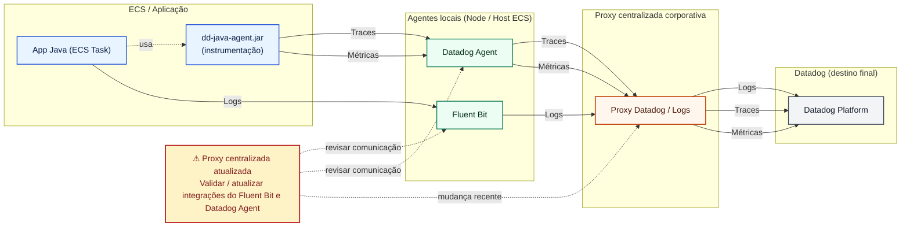

# Fluxo de Observabilidade Java no ECS

```mermaid
flowchart LR
  subgraph ECS["ECS / Aplicação"]
    direction TB
    APP["App Java (ECS Task)"]
    DDJ["dd-java-agent.jar<br/>(instrumentação)"]
    APP -. "usa" .-> DDJ
  end

  subgraph LOCAL["Agentes locais (Node / Host ECS)"]
    direction TB
    FB["Fluent Bit"]
    DDA["Datadog Agent"]
  end

  subgraph PROXY["Proxy centralizada corporativa"]
    direction TB
    PXY["Proxy Datadog / Logs"]
  end

  subgraph DD["Datadog (destino final)"]
    direction TB
    DDOG["Datadog Platform"]
  end

  APP -- "Logs" --> FB
  DDJ -- "Traces" --> DDA
  DDJ -- "Métricas" --> DDA

  FB -- "Logs" --> PXY
  DDA -- "Traces" --> PXY
  DDA -- "Métricas" --> PXY

  PXY -- "Logs" --> DDOG
  PXY -- "Traces" --> DDOG
  PXY -- "Métricas" --> DDOG

  ALERT["⚠ Proxy centralizada atualizada<br/>Validar / atualizar integrações do Fluent Bit e Datadog Agent"]
  ALERT -. "revisar comunicação" .-> FB
  ALERT -. "revisar comunicação" .-> DDA
  ALERT -. "mudança recente" .-> PXY

  classDef app fill:#E8F4FF,stroke:#1D4ED8,color:#0B1F44,stroke-width:1.5px;
  classDef agent fill:#ECFDF3,stroke:#047857,color:#052E16,stroke-width:1.5px;
  classDef proxy fill:#FFF7ED,stroke:#C2410C,color:#431407,stroke-width:1.8px;
  classDef dest fill:#F3F4F6,stroke:#374151,color:#111827,stroke-width:1.5px;
  classDef warn fill:#FEF3C7,stroke:#B91C1C,color:#7F1D1D,stroke-width:2px;

  class APP,DDJ app;
  class FB,DDA agent;
  class PXY proxy;
  class DDOG dest;
  class ALERT warn;
```
